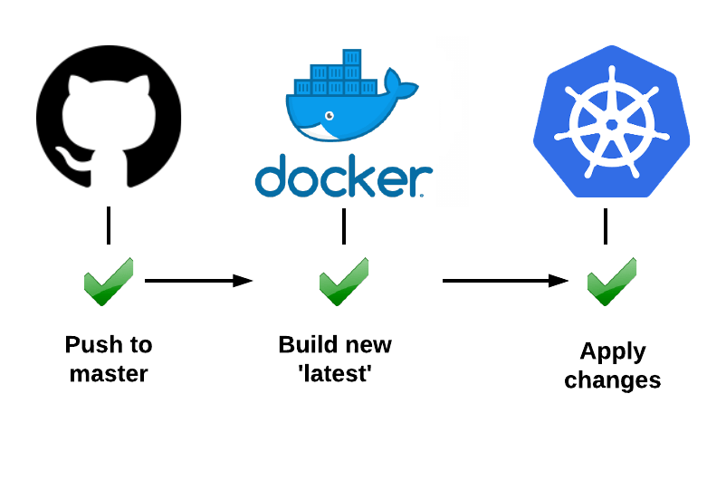

<h1 align="center">Kubernetes Ingress Task</h1>
<!-- <p align="center">
    # Kubernetes Ingress
</p> -->

## Description
In this project we'll :
1. Create a new deployment using the image yanivomc/spring-music:latest.
2. Expose the deploy using type = ClusterIP and with port 8090:8080 
3. Scale pods to 2 .
4. Create an Ingress to access the service using http://127.0.0.1/music URL .

## Getting started

Clone the github repository
```
git clone https://github.com/assiakhateeb/K8S-INGRESS.git
cd K8S-INGRESS
``` 
### Working in your IDE
#### Prerequisites
The following items should be installed and ready in your system:
* [docker](https://docs.docker.com/get-docker/)
* [Kubernetes](https://kubernetes.io/docs/setup/) 
*  NGINX Ingress Controller [Installation Guide](https://kubernetes.github.io/ingress-nginx/deploy/#gce-gke)
Run ```kubectl get pods -n ingress-nginx``` to check if nginx controller is running.
The output is similar to the following: 
    ```
    NAME                                        READY   STATUS      RESTARTS   AGE
    ingress-nginx-admission-create-mmjgp        0/1     Completed   0          67m
    ingress-nginx-admission-patch-kjxxc         0/1     Completed   1          67m
    ingress-nginx-controller-5c8d66c76d-nddcr   1/1     Running     0          6m9s
    ```

* git command line tool , I prefer to work with git Bash <a href="https://git-scm.com/downloads">download</a>.
* Your preferred IDE 
  * IntelliJ IDEA
  * Pycharm
  * [VS Code](https://code.visualstudio.com)

### Running The Application Locally
Before you begin, make sure your Kubernetes cluster is up and running.</br> Follow the steps given below to implement the steps 1 to 4 in the description:

1. Create the Deployment by running the following command:
    ```
    kubectl apply -f spring-deployment.yaml
    ```
2. Run ```kubectl get deploy -owide``` to check if the Deployment was created.
If the Deployment is being created, the output is similar to the following:
    ```
    NAME                READY   UP-TO-DATE   AVAILABLE   AGE   CONTAINERS   IMAGES                         SELECTOR
    spring-deployment   2/2     2            2           88s   spring       yanivomc/spring-music:latest   app=spring

    ```
3. In the file spring-deployment.yaml we've created also a service and an ingress, check the file.
3.1 
Run ```kubectl get svc -owide``` to check if the Service was created.
If the Service is being created, the output is similar to the following:
    ```
    NAME             TYPE        CLUSTER-IP      EXTERNAL-IP   PORT(S)    AGE     SELECTOR
    spring-service   ClusterIP   10.98.146.110   <none>        8090/TCP   108s    app=spring
    ```
    3.2
    Run ```kubectl get ingress -owide``` to check if the Ingress was created.
    If the Ingress is being created, the output is similar to the following:
    ```
    NAME             CLASS    HOSTS   ADDRESS    PORTS   AGE
    spring-ingrees   <none>   *       localhost  80      5m27s
    ```
    3.3
    Run ```kubectl get po -owide``` to check if the Pods was created.
    If the Pods is being created, the output is similar to the following:   
    ```
    NAME                                READY   STATUS    RESTARTS   AGE   IP          NODE             NOMINATED NODE   READINESS GATES
    spring-deployment-dd9dbb4d8-82gng   1/1     Running   0          26s   10.1.0.63   docker-desktop   <none>           <none>
    ``` 

4. Scale your pods to 2 by running the following command:
    ```
    kubectl scale deployment --replicas=2 spring-deployment
    ```
    4.1 
    Run ```kubectl get po -owide``` to check if the Pods.
    Output:
    ```
    NAME                                READY   STATUS              RESTARTS   AGE   IP          NODE             NOMINATED NODE   READINESS GATES
    spring-deployment-dd9dbb4d8-82gng   1/1     Running             0          67s   10.1.0.63   docker-desktop   <none>           <none>
    spring-deployment-dd9dbb4d8-q5r5w   0/1     ContainerCreating   0          5s    <none>      docker-desktop   <none>           <none>
    ```
5. Forward a local port to a port on the deployment Pods.
    ```
    kubectl port-forward deployments/spring-deployment 8080
    ```
    If the above commands works. The output is similar to this:
    ```
    Forwarding from 127.0.0.1:8080 -> 8080
    Forwarding from [::1]:8080 -> 8080
    Handling connection for 8080
    Handling connection for 8080
    Handling connection for 8080
    ```
6. Now you can access http://127.0.0.1/music URL.


Full Spring Music Page:


### Supported Components
- Core
  - [kubernetes](https://github.com/kubernetes/kubernetes) 
  - [docker](https://www.docker.com/) 
- Application
  - [ingress-nginx](https://github.com/kubernetes/ingress-nginx) 
 
 ### Useful Links
 [Deployments | Kubernetes](https://kubernetes.io/docs/concepts/workloads/controllers/deployment/)
 [Service | Kubernetes](https://kubernetes.io/docs/concepts/services-networking/service/)
 [Use Port Forwarding to Access Applications in a Cluster](https://kubernetes.io/docs/tasks/access-application-cluster/port-forward-access-application-cluster/)